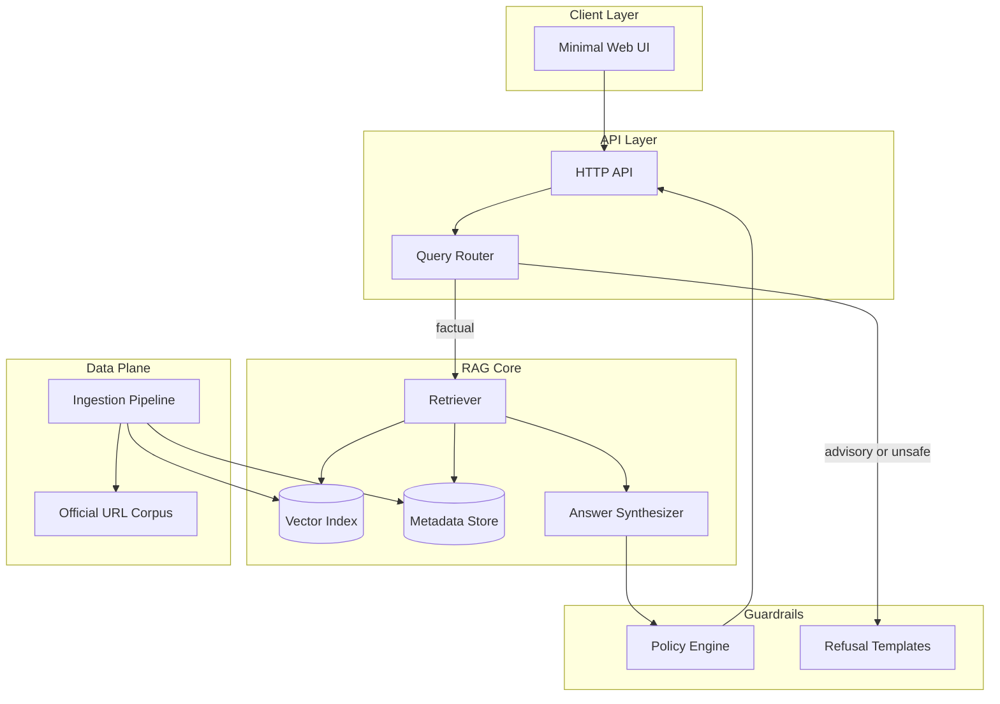
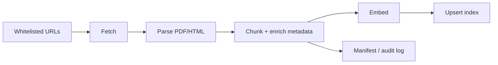
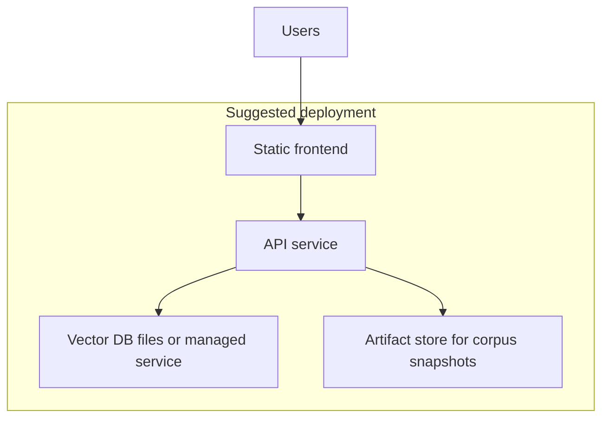

# Mutual Fund FAQ Assistant — Phase-Wise Architecture

This document describes a phase-wise system architecture for the **facts-only Mutual Fund FAQ Assistant** defined in the project problem statement. It is optimized for **accuracy, source traceability, and compliance** (no investment advice).

---

## 1. Guiding Principles

| Principle | Architectural implication |
|-----------|---------------------------|
| Facts-only | Separate **intent routing** (factual vs advisory) before retrieval or generation. |
| Official sources only | **Corpus is closed**: only whitelisted URLs/domains are ingested and cited. |
| Verifiable answers | **Single canonical citation** per response; chunks retain stable URL + fetch metadata. |
| Minimal UI | Thin client; heavy logic in backend RAG + policy layer. |
| Privacy | No PII collection in UI or logs; stateless or session-id-only if needed. |

---

## 2. Target Architecture (Logical View)



**Data flow summary**

1. User question enters the **Query Router** (classifier + light rules).
2. **Factual** queries trigger **retrieval** over an index built only from approved documents.
3. **Answer Synthesizer** produces at most three sentences, **exactly one** source URL, and a **“Last updated from sources”** line derived from ingestion metadata.
4. **Policy Engine** validates length, citation count, banned phrases, and advisory leakage before returning to the client.

---

## 3. Phase 0 — Scope, Corpus, and Compliance Baseline

**Goals:** Lock scope so engineering stays “lightweight” and auditable.

| Workstream | Activities |
|------------|------------|
| **AMC & schemes** | **HDFC Mutual Fund (HDFC AMC)** — **five schemes** with category diversity: mid-cap, diversified equity, focused / concentrated, ELSS (tax saver), large-cap — see **Project scheme pages (Groww)** below. |
| **URL inventory** | Anchor the corpus around the **five Groww scheme URLs below** for this project; extend to **15–25 total URLs** by adding HDFC AMC factsheets/KIM/SID, AMC FAQs, AMFI/SEBI pages, and statement/tax guides as needed. |
| **Domain whitelist** | Encode allowed hosts: **`groww.in`** (for locked scheme catalogue pages below), HDFC AMC / registrar official hosts, **`amfiindia.com`**, **`sebi.gov.in`**, etc. Reject all others at ingestion and at citation validation. |
| **Citation rules** | Define the single-link rule, footer format, and refusal wording aligned with problem statement §2–3. |
| **PII policy** | Explicitly disable forms/persistence for PAN, Aadhaar, accounts, OTPs, email, phone in UI and APIs. |

### Project scheme pages (Groww)

These URLs define the **in-scope HDFC schemes** for this implementation:

| Scheme (indicative category) | URL |
|------------------------------|-----|
| HDFC Mid-Cap Fund — Direct Growth | [groww.in/mutual-funds/hdfc-mid-cap-fund-direct-growth](https://groww.in/mutual-funds/hdfc-mid-cap-fund-direct-growth) |
| HDFC Equity Fund — Direct Growth | [groww.in/mutual-funds/hdfc-equity-fund-direct-growth](https://groww.in/mutual-funds/hdfc-equity-fund-direct-growth) |
| HDFC Focused Fund — Direct Growth | [groww.in/mutual-funds/hdfc-focused-fund-direct-growth](https://groww.in/mutual-funds/hdfc-focused-fund-direct-growth) |
| HDFC ELSS Tax Saver Fund — Direct Plan Growth | [groww.in/mutual-funds/hdfc-elss-tax-saver-fund-direct-plan-growth](https://groww.in/mutual-funds/hdfc-elss-tax-saver-fund-direct-plan-growth) |
| HDFC Large Cap Fund — Direct Growth | [groww.in/mutual-funds/hdfc-large-cap-fund-direct-growth](https://groww.in/mutual-funds/hdfc-large-cap-fund-direct-growth) |

**Outputs:** Written corpus manifest (YAML/JSON), whitelist config (including the five URLs above plus supplemental official URLs), disclaimer copy for UI.

---

## 4. Phase 1 — Ingestion, Parsing, and Indexing

**Goals:** Build a **curated, immutable-versioned** document store and searchable index from official sources only.

### 4.0 Subphases (implement one by one)

We will implement Phase 1 incrementally using the subphases below. Each subphase should be independently runnable and should produce artifacts that later subphases consume.

| Subphase | Name | Input | Output (artifacts) |
|---------:|------|-------|---------------------|
| **1.1** | **Corpus + whitelist validation** | Phase 0 `manifest` + `whitelist` + scheme list | Validated URL list, normalized canonical URLs, rejected URL report |
| **1.2** | **Fetching + snapshotting** | Validated URLs | Raw snapshots (HTML/PDF), per-URL `content_hash`, `fetched_at`, HTTP status log |
| **1.3** | **Parsing (PDF/HTML → text)** | Raw snapshots | Extracted text, parse-quality flags (empty, OCR-needed, etc.) |
| **1.4** | **Normalization + cleaning** | Parsed text | **De-noised** text blocks optimized for retrieval (boilerplate reduced), stable section markers/line breaks, and quality metrics (empty/short/noisy) |
| **1.5** | **Chunking + metadata enrichment** | Normalized text + scheme scope | Chunks with metadata (`source_url`, `document_type`, `scheme_id`, `fetched_at`, `content_hash`) |
| **1.6** | **Embedding** | Chunks | Vectors (embedder versioned) + chunk id mapping |
| **1.7** | **Index upsert + build manifest** | Vectors + chunk metadata | Vector index build `index_v{n}` + audit manifest used for “Last updated from sources” |

### 4.0.4 Subphase 1.4 (Normalization) — practical notes for this corpus

With the current Phase 0 corpus, the fetched documents are predominantly **HTML pages** (Groww scheme pages + AMFI/SEBI/HDFC hubs). Parsed HTML text tends to include a lot of **navigation / UI boilerplate** and can lose some of the original page’s structure.

To match these realities, Phase **1.4** should do more than encoding fixes:

- **Boilerplate reduction**: remove or down-weight repeated site chrome text (nav menus, footer links, cookie banners, login/signup prompts).
- **Whitespace + line-break stabilization**: normalize excessive whitespace and create predictable paragraph breaks to help chunking.
- **Light section heuristics**: introduce section markers using headings/labels that survive parsing (e.g., repeated tokens like “Expense Ratio”, “Exit Load”, “Minimum SIP”, “Benchmark”, “Risk”).
- **Quality metrics**: compute flags per document such as `empty`, `too_short`, `high_nav_ratio` (approx), `likely_dynamic_shell`, so later steps can skip low-signal docs.
- **Preserve provenance**: normalization must not lose `source_url`, `content_hash`, and `fetched_at` from Phase 1.2 for audit and “Last updated” correctness.

### 4.1 Components

| Component | Responsibility |
|-----------|----------------|
| **Fetcher** | HTTP GET with polite crawling policy; respect `robots.txt` where applicable; store raw snapshot hash. |
| **Normalizer** | Convert PDF/HTML to clean text; preserve section headings for chunk boundaries. |
| **Chunker** | Segment by logical sections (e.g., “Expense ratio”, “Exit load”) with overlap for retrieval stability. |
| **Embedder** | **Google Gemini embeddings** (`models/embedding-001`) for semantic understanding and improved retrieval quality. |
| **Vector index** | Stores vectors + pointers to chunk metadata in ChromaDB. |
| **Metadata store** | Per chunk: `source_url`, `document_type` (factsheet, KIM, etc.), `fetched_at`, `content_hash`, optional `scheme_id`. |

### 4.2 Ingestion pipeline (batch)



**Outputs:** Rebuildable index version (e.g., `index_v{n}`), audit log of fetched URLs and timestamps for the **“Last updated from sources: `<date>`”** footer.

---

## 5. Phase 2 — Retrieval Layer

**Goals:** Retrieve **small, high-precision** context for factual MF questions.

### 5.1 Retrieval strategy

Given the **current corpus reality** (mostly **HTML** pages with flattened text) and the current Phase 1 embedding implementation (**Google Gemini embeddings**), the retrieval uses **semantic vector similarity** combined with **metadata filtering** for optimal precision and recall.

1. **Query preprocessing (entity + topic detection):**
   - Detect scheme using aliases → map to `scheme_id` (from Phase 0 `schemes.json`).
   - Detect topic/slot using keywords → map to chunk `section` labels (e.g., “Exit Load”, “Minimum SIP”, “Benchmark”, “Risk/Riskometer”, “ELSS/Lock-in”).
2. **Hard metadata filtering (precision first):**
   - Prefer `(scheme_id + section)` → fallback to `(scheme_id only)` → `(section only)` → `(no filter)` if necessary.
3. **Semantic vector retrieval:**
   - Score candidates using **Gemini embedding similarity** for semantic understanding of user intent and content.
4. **Lexical fallback + rerank:**
   - Combine with **BM25 / keyword overlap** for precision on specific terms (expense ratios, percentages, etc.).
   - Prefer cleaner sections (e.g., "Exit Load" over comparison tables), newest `fetched_at` on ties, and deduplicate near-identical chunks from the same `source_url`.
5. **Top-k selection:**
   - Keep `k` small (e.g., **3–5**) to reduce conflicts and maintain focus.

**Outputs to downstream:** Retrieved chunks, each with **one primary URL** candidate for citation (typically the URL of the chunk’s source document).

---

## 6. Phase 3 — Generation, Formatting, and Citations

**Goals:** Satisfy **§2 FAQ Assistant Requirements**: max **3 sentences**, **exactly one** citation link **when the answer is grounded**, plus footer date **only when a source is cited**.

### 6.1 Answer Synthesizer

| Rule | Implementation hint |
|------|-------------------|
| Max 3 sentences | **Gemini LLM** with structured prompt enforcing 3-sentence limit |
| Exactly one link (when grounded) | If retrieval is **confident**, post-processor attaches **one** URL from retrieved metadata (prefer factsheet for figures; otherwise highest-scoring chunk's URL) |
| **Unknown / insufficient evidence** | If the system **cannot** justify an answer from retrieved context (empty results, scores below threshold, contradictory/empty text, or **unscoped** retrieval with no identifiable scheme/topic anchor), **Gemini** responds with a **short facts-only** explanation and **do not attach any URL**. Avoid inventing links or "best effort" citations. |
| **Personal information** | Do **not** request, store, or echo user PII in answers. If the query contains likely PII patterns, **Gemini** responds without any URL and invites the user to rephrase without personal identifiers. |
| Performance queries | No comparative returns; direct user to **official factsheet link** per constraints (only when grounded on that source) |
| Footer | When (and only when) a citation URL is included: `Last updated from sources: <date>` where `<date>` is derived from **max(`fetched_at`)** across chunks used for the answer, or the index build manifest's suggested date |

### 6.2 Optional structured intermediate

For robustness, use a constrained intermediate format (JSON) with fields: `answer_sentences[]`, `citation_url` (nullable when unknown/PII), `source_dates[]`, `grounded`, then render to plain text for the UI.

---

## 7. Phase 4 — Guardrails: Refusal, Advisory Detection, and Safety

**Goals:** Meet **§3 Refusal Handling** and **Constraints** consistently.

### 7.1 Query Router

| Path | Trigger examples | Behavior |
|------|------------------|----------|
| **Refusal** | “Should I invest?”, “Which fund is better?”, implicit recommendation | Return **polite refusal** + **one educational link** (AMFI/SEBI), no fund-specific advice |
| **Factual** | Expense ratio, exit load, min SIP, ELSS lock-in, riskometer, benchmark, download steps | Route to RAG path |
| **Ambiguous** | Ask one clarifying question **or** retrieve generic AMFI/SEBI page if clarification would imply advice |

Implement as **classifier + lexicon** (lightweight) with optional LLM assist **only** for classification—not for open-ended advice.

### 7.2 Response Policy Engine

- Block outputs containing **imperatives to buy/sell**, superlatives (“best fund”), or **return comparisons** not explicitly present as factual reporting in source text.
- Validate **exactly one** URL and allowed domains.
- Enforce disclaimer-adjacent tone: descriptive, not prescriptive.

**Outputs:** Standardized refusal template library; logging of refusal reasons (without PII).

---

## 8. Phase 5 — Minimal User Interface

**Goals:** Implement **§4 User Interface (Minimal)**.

| Element | Behavior |
|---------|----------|
| Welcome message | Sets expectations: facts-only, single source per answer |
| Three example questions | Pre-filled or clickable prompts aligned with allowed factual topics |
| Visible disclaimer | “Facts-only. No investment advice.” |
| Chat input | Sends query to backend; displays answer + link + **Last updated** line |

**Architecture note:** UI is a thin layer; **no client-side RAG** and no storage of personal identifiers.

---

## 9. Phase 6 — Quality Assurance and Operational Readiness

**Goals:** Meet **Success Criteria** and support maintainability.

| Activity | Description |
|----------|-------------|
| **Golden questions** | Curated set covering expense ratio, exit load, SIP minimum, ELSS lock-in, riskometer, benchmark, statement downloads |
| **Regression checks** | Expected refusal on advisory prompts; expected citations from whitelist |
| **Drift handling** | Scheduled re-ingestion; versioned index; surface **last updated** honestly (see **Scheduler** below) |
| **Limitations doc** | Capture stale PDFs, OCR errors, scheme name ambiguity in README |

### Scheduler (recommended): GitHub Actions

To keep sources fresh without manual runs, use **GitHub Actions** as the scheduler to periodically execute the ingestion subphases:

#### Workflow Configuration

```yaml
# .github/workflows/refresh-corpus.yml
name: Refresh Mutual Fund Corpus
on:
  schedule:
    # Run daily at 2:00 AM UTC (7:30 AM IST)
    - cron: '0 2 * * *'
  workflow_dispatch:
    # Allow manual triggers for urgent updates

jobs:
  refresh:
    runs-on: ubuntu-latest
    steps:
      - uses: actions/checkout@v4
      
      - name: Setup Python
        uses: actions/setup-python@v4
        with:
          python-version: '3.11'
          
      - name: Install dependencies
        run: |
          pip install -r requirements.txt
          pip install chromadb
          
      - name: Validate corpus scope
        run: python phases/phase-1/ingestion/subphase-1.1/validate_corpus.py
        
      - name: Run ingestion pipeline
        run: |
          python phases/phase-1/ingestion/subphase-1.2/fetch_snapshots.py
          python phases/phase-1/ingestion/subphase-1.3/parse_documents.py
          python phases/phase-1/ingestion/subphase-1.4/normalize_text.py
          python phases/phase-1/ingestion/subphase-1.5/chunk_documents.py
          python phases/phase-1/ingestion/subphase-1.6/embed_chunks.py
          python phases/phase-1/ingestion/subphase-1.7/upsert_index.py
          
      - name: Commit updated artifacts
        run: |
          git config --local user.email "action@github.com"
          git config --local user.name "GitHub Action"
          git add phases/phase-1/ingestion/subphase-1.*/output/
          git commit -m "Auto-update corpus and index $(date '+%Y-%m-%d')" || exit 0
          git push
```

#### Data Freshness Strategy

- **Frequency**: Daily refresh (adjustable based on source volatility)
- **Triggers**: 
  - Scheduled: Daily at 2:00 AM UTC
  - Manual: `workflow_dispatch` for urgent updates
  - API: Webhook trigger for real-time updates (future enhancement)

- **Artifact Management**:
  - **ChromaDB**: Persistent vector storage with automated updates
  - **Manifests**: Versioned index build manifests with timestamps
  - **Audit Trail**: Git commits track all corpus changes
  - **Rollback**: Previous versions retained in Git history

- **Quality Controls**:
  - **Whitelist enforcement**: CI fails if unauthorized URLs detected
  - **Content validation**: Checks for empty/invalid chunks
  - **Size monitoring**: Alerts on unusual corpus size changes
  - **Citation integrity**: Verifies all chunks have valid metadata

- **Freshness Indicators**:
  - **Footer date**: `Last updated from sources: <date>` from `max_fetched_at_utc`
  - **Index version**: Auto-incremented (`index_v1`, `index_v2`, etc.)
  - **Build manifest**: Contains detailed freshness metadata
  - **Health checks**: API endpoint `/health` reports corpus age

#### Monitoring & Alerts

- **Success**: Workflow completion updates corpus timestamp
- **Failure**: GitHub Actions notifications on ingestion errors
- **Drift detection**: Weekly reports on content changes
- **Performance**: Track ingestion duration and chunk counts

---

## 10. Deployment View (Reference)



For a **lightweight** MVP, the vector index and metadata can live on **local disk** or a **single managed** vector store; scale-up is optional and not required by the problem statement.

---

## 11. Cross-Cutting Concerns

| Concern | Approach |
|---------|----------|
| **Auditability** | Persist ingestion manifests; log which URL underpinned each citation. |
| **Security** | HTTPS; no PII fields in API contracts; rate-limit public endpoint if exposed. |
| **Transparency** | Single source link + last-updated date on every factual answer. |
| **Cost/latency** | Small `k`, short answers, small model option for synthesis if costs matter. |

---

## 12. Mapping to Deliverables

| Expected deliverable | Where it lives architecturally |
|---------------------|--------------------------------|
| README + setup | Repo root; references ingestion scripts and environment variables |
| Selected AMC & schemes | Corpus manifest (Phase 0) |
| Architecture overview (RAG) | This document + short summary in README |
| Known limitations | QA phase + README |
| Disclaimer snippet | UI (Phase 5) + API error/refusal templates |

---

## 13. Edge-case catalogs (per phase)

Operational and testing edge cases for each phase live in paired documents:

| Phase | Edge-case file |
|-------|----------------|
| Phase 0 | [edge-cases-phase-0.md](edge-cases-phase-0.md) |
| Phase 1 | [edge-cases-phase-1.md](edge-cases-phase-1.md) |
| Phase 2 | [edge-cases-phase-2.md](edge-cases-phase-2.md) |
| Phase 3 | [edge-cases-phase-3.md](edge-cases-phase-3.md) |
| Phase 4 | [edge-cases-phase-4.md](edge-cases-phase-4.md) |
| Phase 5 | [edge-cases-phase-5.md](edge-cases-phase-5.md) |
| Phase 6 | [edge-cases-phase-6.md](edge-cases-phase-6.md) |

---

## 14. Summary

This architecture delivers a **closed-corpora RAG** system: **official URLs only**, **router-first guardrails**, **retrieval with rich metadata**, and **strict output shaping** (three sentences, one link, last-updated footer). Phases progress from **corpus definition** through **ingestion**, **retrieval**, **generation**, **refusal/policy**, **minimal UI**, and **QA/operations**, aligned with the problem statement’s emphasis on **trust, transparency, and compliance** over speculative or advisory assistance.
